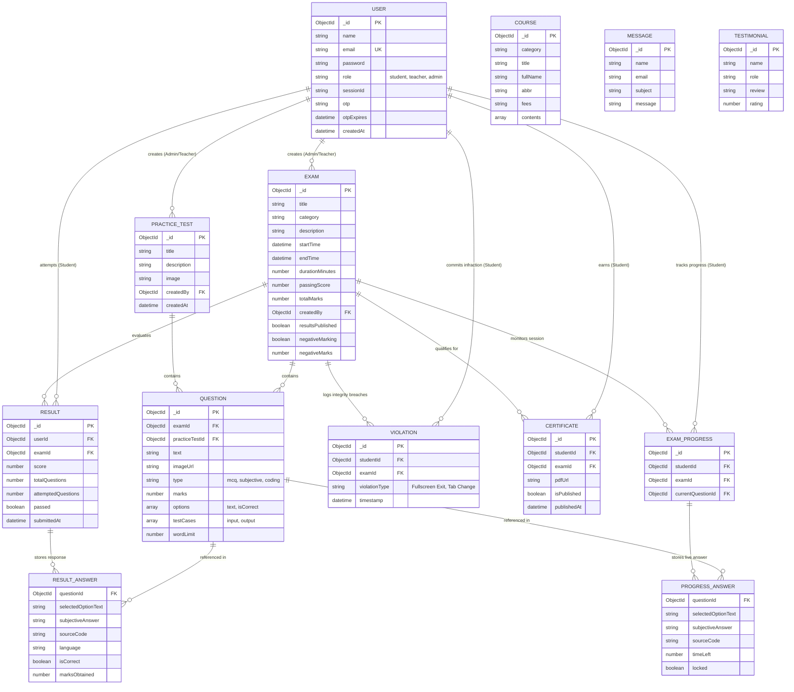

# Entity-Relationship (ER) Diagram & Schema Specifications
## Project Name: CDAC ExamWeb

This document outlines the conceptual data models, entity relationships, and cardinalities used across the **CDAC ExamWeb** application.

---

## 1. Visual ER Diagram (Mermaid)

---

## 2. Entity Specifications & Cardinality Matrix

| Primary Entity | Related Entity | Relationship Type | Cardinality | Description |
| :--- | :--- | :--- | :--- | :--- |
| **User** | **Exam** | One-to-Many (`1 : N`) | `1 : 0..N` | A Teacher or Admin can create multiple examinations. |
| **User** | **PracticeTest** | One-to-Many (`1 : N`) | `1 : 0..N` | A Teacher or Admin can author multiple mock tests. |
| **User** | **Result** | One-to-Many (`1 : N`) | `1 : 0..N` | A Student can attempt multiple assessments, generating separate results. |
| **User** | **ExamProgress** | One-to-One / Many (`1 : N`) | `1 : 0..N` | Tracks live session progress per student per active exam (`unique: studentId + examId`). |
| **User** | **Violation** | One-to-Many (`1 : N`) | `1 : 0..N` | Logs proctoring infractions committed by a student during tests. |
| **User** | **Certificate** | One-to-Many (`1 : N`) | `1 : 0..N` | A student earns certificates upon passing examinations. |
| **Exam** | **Question** | One-to-Many (`1 : N`) | `1 : 1..N` | An examination contains multiple questions of varied types (`mcq`, `subjective`, `coding`). |
| **PracticeTest**| **Question** | One-to-Many (`1 : N`) | `1 : 1..N` | A practice test contains mock assessment questions. |
| **Exam** | **Result** | One-to-Many (`1 : N`) | `1 : 0..N` | An examination has results for every student attempt. |
| **Exam** | **Violation** | One-to-Many (`1 : N`) | `1 : 0..N` | Violations are recorded against a specific examination session. |
| **Exam** | **Certificate** | One-to-Many (`1 : N`) | `1 : 0..N` | Certificates issued specifically for an examination. |

---

## 3. Data Dictionary (Key Schemas)

### 3.1 User (`users`)
- **`_id`**: Primary Key (ObjectId)
- **`email`**: Unique Identifier string used for authentication
- **`password`**: Hashed string stored via `bcrypt`
- **`role`**: Enumerated String (`'student'`, `'teacher'`, `'admin'`)

### 3.2 Exam (`exams`)
- **`_id`**: Primary Key (ObjectId)
- **`createdBy`**: Foreign Key (`User._id`) representing author faculty
- **`passingScore`**: Numeric threshold percentage
- **`durationMinutes`**: Timer limit enforced in `ExamArena.jsx`

### 3.3 Question (`questions`)
- **`_id`**: Primary Key (ObjectId)
- **`examId`**: Optional Foreign Key linking to formal examination (`Exam._id`)
- **`practiceTestId`**: Optional Foreign Key linking to mock exam (`PracticeTest._id`)
- **`type`**: Discriminator string indicating format (`mcq`, `subjective`, `coding`)
- **`options`**: Array of sub-documents containing text and boolean `isCorrect` flag
- **`testCases`**: Array of sub-documents containing standard input/output pairs for code execution

### 3.4 Result (`results`)
- **`_id`**: Primary Key (ObjectId)
- **`userId`**: Foreign Key (`User._id`) identifying the candidate
- **`examId`**: Foreign Key (`Exam._id`) identifying the test
- **`answers`**: Array embedding student choices, source code submissions, and question-level scores
