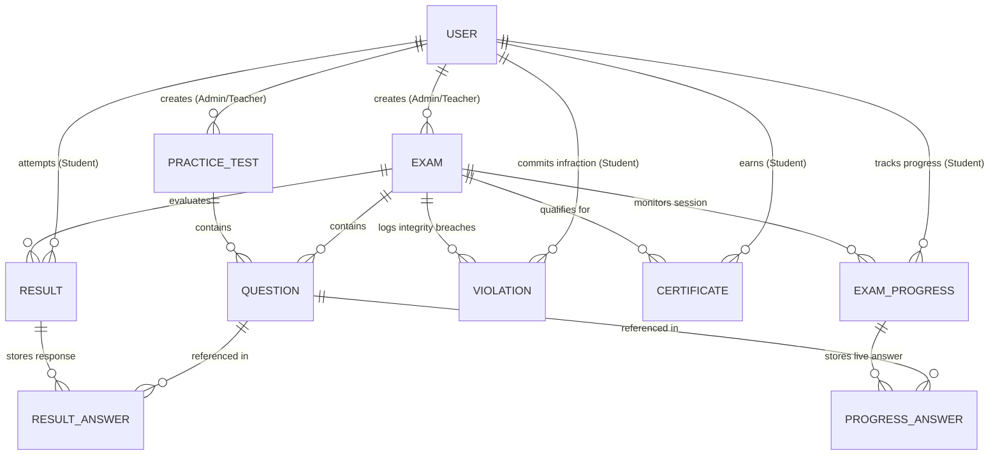

# Software Requirements Specification (SRS)
## Project Name: CDAC ExamWeb (Online Examination & Assessment Portal)
**Version:** 1.0  
**Date:** July 2026  

---

## Table of Contents
1. [Introduction](#1-introduction)  
   1.1 [Purpose](#11-purpose)  
   1.2 [Scope](#12-scope)  
   1.3 [Definitions, Acronyms, and Abbreviations](#13-definitions-acronyms-and-abbreviations)  
   1.4 [References](#14-references)  
   1.5 [Overview](#15-overview)  
2. [Overall Description](#2-overall-description)  
   2.1 [Product Perspective](#21-product-perspective)  
   2.2 [Product Functions](#22-product-functions)  
   2.3 [User Classes and Characteristics](#23-user-classes-and-characteristics)  
   2.4 [Operating Environment](#24-operating-environment)  
   2.5 [Design and Implementation Constraints](#25-design-and-implementation-constraints)  
   2.6 [User Documentation](#26-user-documentation)  
   2.7 [Assumptions and Dependencies](#27-assumptions-and-dependencies)  
3. [System Architecture & Data Model](#3-system-architecture--data-model)  
   3.1 [High-Level Architecture](#31-high-level-architecture)  
   3.2 [Database Schema Overview](#32-database-schema-overview)  
   3.3 [Entity-Relationship (ER) Diagram](#33-entity-relationship-er-diagram)  
4. [Functional Requirements](#4-functional-requirements)  
   4.1 [Module 1: Authentication & User Management](#41-module-1-authentication--user-management)  
   4.2 [Module 2: Course & Examination Management (Admin/Teacher)](#42-module-2-course--examination-management-adminteacher)  
   4.3 [Module 3: Exam & Practice Arena (Student)](#43-module-3-exam--practice-arena-student)  
   4.4 [Module 4: AI/Automated Proctoring & Violation Tracking](#44-module-4-aiautomated-proctoring--violation-tracking)  
   4.5 [Module 5: Evaluation, Results & Analytics](#45-module-5-evaluation-results--analytics)  
   4.6 [Module 6: Certificate Generation](#46-module-6-certificate-generation)  
   4.7 [Module 7: Interactive Code Compiler](#47-module-7-interactive-code-compiler)  
5. [External Interface Requirements](#5-external-interface-requirements)  
   5.1 [User Interfaces](#51-user-interfaces)  
   5.2 [Hardware Interfaces](#52-hardware-interfaces)  
   5.3 [Software Interfaces](#53-software-interfaces)  
   5.4 [Communication Interfaces](#54-communication-interfaces)  
6. [Non-Functional Requirements](#6-non-functional-requirements)  
   6.1 [Performance Requirements](#61-performance-requirements)  
   6.2 [Security & Privacy Requirements](#62-security--privacy-requirements)  
   6.3 [Reliability & Availability](#63-reliability--availability)  
   6.4 [Usability & Accessibility](#64-usability--accessibility)  

---

## 1. Introduction

### 1.1 Purpose
This Software Requirements Specification (SRS) documents the complete requirements for **CDAC ExamWeb**, a comprehensive, full-stack web-based online assessment, practice, and examination management system. The document is intended for project evaluators, software architects, developers, and testers to understand the architectural design, functional features, and non-functional specifications of the system.

### 1.2 Scope
**CDAC ExamWeb** is designed to streamline online examinations and learning evaluation for CDAC students and faculty. The system encompasses:
- **Student Portal:** Allows candidates to enroll in courses, attempt practice tests, take live proctored examinations, track performance analytics, and download completion certificates.
- **Teacher/Admin Dashboard:** Provides tools for creating and scheduling exams, curating question banks, monitoring exam attempts, reviewing proctoring violations, and publishing results.
- **Proctoring Engine:** Enforces academic integrity by monitoring user environment behavior (tab-switching, fullscreen exits, window focus loss).

### 1.3 Definitions, Acronyms, and Abbreviations
- **SRS:** Software Requirements Specification
- **JWT:** JSON Web Token (used for secure, stateless authentication)
- **ODM:** Object Data Modeling (Mongoose for MongoDB)
- **REST:** Representational State Transfer
- **Proctoring:** Automated monitoring of candidate activity during an online assessment
- **Arena:** The dedicated exam/practice simulation workspace where questions are displayed and timed

### 1.4 References
- IEEE Std 830-1998, *IEEE Recommended Practice for Software Requirements Specifications*
- React 18 & Vite Documentation
- Node.js & Express.js REST API Architecture Guidelines
- MongoDB & Mongoose Schema Modeling Standards

### 1.5 Overview
The remainder of this document details the overall architectural perspective, specific functional modules mapped to backend models and routes, interface requirements, and non-functional performance/security standards.

---

## 2. Overall Description

### 2.1 Product Perspective
CDAC ExamWeb is an independent, responsive web application built using the **MERN Stack** (MongoDB, Express.js, React, Node.js). It functions as a centralized assessment portal communicating via RESTful JSON APIs over HTTP/HTTPS.

```
+-------------------------------------------------------------------+
|                        Client Layer (React + Vite)                |
|   [Student Dashboard]  [Exam Arena]  [Admin/Teacher Dashboard]    |
+-------------------------------------------------------------------+
                                  |
                   RESTful APIs (Axios / JSON / JWT)
                                  |
                                  v
+-------------------------------------------------------------------+
|                     Server Layer (Node.js + Express)              |
|  [Auth Controller] [Exam Engine] [Proctoring Logger] [Compiler]   |
+-------------------------------------------------------------------+
                                  |
                     Mongoose ODM / GridFS / Multer
                                  |
                                  v
+-------------------------------------------------------------------+
|                    Database Layer (MongoDB Atlas / Local)         |
|  [Users] [Exams] [Questions] [Results] [Violations] [Certificates]|
+-------------------------------------------------------------------+
```

### 2.2 Product Functions
- **Multi-Role Access Control:** Secure registration and login for Students, Teachers, and Administrators.
- **Course & Practice Management:** Creation of study modules and mock practice arenas.
- **Dynamic Exam Arena:** Real-time countdown timer, question palette navigation (Answered, Marked for Review, Unvisited), and auto-submission upon expiry.
- **Anti-Cheat Proctoring:** Detection and real-time logging of suspicious activities (tab switches, minimizing window).
- **Automated Grading & Analytics:** Instantaneous score evaluation, graphical performance insights, and question-level breakdowns.
- **Certificate Issuance:** Automated issuance and verification of digital certificates upon successfully passing qualifying assessments.

### 2.3 User Classes and Characteristics
1. **Student / Candidate:**
   - Registers and logs in to access courses and tests.
   - Requires a simple, distraction-free UI during exams (`ExamArena.jsx`).
   - Views past results and downloads certificates from `StudentDashboard.jsx`.
2. **Teacher / Faculty:**
   - Manages question banks, sets time limits, and creates assessments via `TeacherDashboard.jsx`.
   - Reviews candidate performance and monitors integrity violations.
3. **Administrator:**
   - Exercises full CRUD privileges over system users, courses, testimonials, and platform configurations via `AdminDashboard.jsx`.

### 2.4 Operating Environment
- **Client Side:** Any modern web browser supporting ES6, HTML5, and CSS3 (Google Chrome, Mozilla Firefox, Microsoft Edge, Safari).
- **Server Side:** Node.js runtime environment (v18+ recommended).
- **Database:** MongoDB server (Local instance or MongoDB Atlas Cloud).

### 2.5 Design and Implementation Constraints
- **Session Security:** Strict adherence to stateless JWT tokens stored securely on the client side.
- **Browser Sandbox:** Proctoring restrictions rely on browser Fullscreen API and Page Visibility API events.
- **Network Resilience:** The exam arena must preserve state or progress periodically (`ExamProgress.js`) to prevent data loss on sudden disconnections.

---

## 3. System Architecture & Data Model

### 3.1 High-Level Architecture
The application follows a modular Model-View-Controller (MVC) pattern on the backend coupled with a Component-Based Single Page Application (SPA) on the frontend.

### 3.2 Database Schema Overview (MongoDB Models)
The backend encapsulates 11 primary data collections:
1. `User.js`: Stores profile details, hashed passwords (`bcrypt`), role (`student`, `teacher`, `admin`), and enrollment data.
2. `Course.js`: Stores course metadata, descriptions, banners, and associated tests.
3. `Exam.js`: Holds formal examination details (title, duration, total marks, scheduled time, passing criteria).
4. `PracticeTest.js`: Holds mock tests designed for self-paced student evaluation.
5. `Question.js`: Stores individual question stems, multiple-choice options, correct option indices, marks, and explanations.
6. `Result.js`: Records student test attempts, overall scores, accuracy percentage, time taken, and answer mappings.
7. `ExamProgress.js`: Maintains live state during active examination sessions.
8. `Violation.js`: Logs timestamps and descriptions of proctoring infractions committed by a student during an exam session.
9. `Certificate.js`: Stores verification IDs, issue dates, and student/exam linkages for generated certificates.
10. `Message.js`: Stores contact inquiries submitted via the public portal.
11. `Testimonial.js`: Manages student feedback and review cards displayed on the landing page.

### 3.3 Entity-Relationship (ER) Diagram
Below is the conceptual Entity-Relationship Diagram illustrating the core relationships between system entities (Users, Exams, Questions, Results, Progress, and Violations):



*(Note: For the standalone ER documentation including exact attributes and cardinality matrix, see [docs/ER_DIAGRAM.md](file:///c:/Users/sneha/OneDrive/Desktop/6Month/cdac-examweb/docs/ER_DIAGRAM.md))*

---

## 4. Functional Requirements

### 4.1 Module 1: Authentication & User Management
- **REQ-AUTH-01:** The system shall allow users to register with their name, email, password, and desired role.
- **REQ-AUTH-02:** The backend shall encrypt all user passwords using `bcrypt` before database persistence.
- **REQ-AUTH-03:** Upon successful authentication (`POST /api/auth/login`), the server shall issue a signed JWT valid for authenticated requests.
- **REQ-AUTH-04:** The frontend shall decode the JWT (`jwt-decode`) to enforce route guards (`AuthLandingPage.jsx`).

### 4.2 Module 2: Course & Examination Management (Admin/Teacher)
- **REQ-EXAM-01:** Teachers and Admins shall be able to create, edit, and delete practice tests (`/api/practice-tests`) and live exams (`/api/exams`).
- **REQ-EXAM-02:** Authorized faculty shall be able to upload media files and test banners using `multer` middleware.
- **REQ-EXAM-03:** Questions shall be linked to specific assessments (`/api/questions`), supporting multiple-choice options with designated correct answers and weightages.

### 4.3 Module 3: Exam & Practice Arena (Student)
- **REQ-ARENA-01:** Prior to exam entry, students must review and accept mandatory instructions (`ExamInstructions.jsx`).
- **REQ-ARENA-02:** The system shall display a live, synchronized countdown timer that automatically forces submission when time reaches `00:00:00`.
- **REQ-ARENA-03:** Candidates shall be provided a visual question navigation palette indicating:
  - *Not Visited*
  - *Visited / Not Answered*
  - *Answered*
  - *Marked for Review*
- **REQ-ARENA-04:** Periodic progress updates shall be synced to `/api/progress` to recover session state in case of accidental browser refresh.

### 4.4 Module 4: AI/Automated Proctoring & Violation Tracking
- **REQ-PROC-01:** The Exam Arena shall enforce Fullscreen mode upon starting an assessment.
- **REQ-PROC-02:** If a candidate exits Fullscreen or switches browser tabs/windows (Page Visibility API blur event), the system shall display a warning modal.
- **REQ-PROC-03:** Every infraction shall trigger an asynchronous API call to `/api/violations`, logging the student ID, exam ID, timestamp, and violation type.
- **REQ-PROC-04:** Exceeding the maximum allowed violation threshold shall automatically terminate and submit the examination.

### 4.5 Module 5: Evaluation, Results & Analytics
- **REQ-EVAL-01:** Upon submission (`POST /api/results`), the backend shall instantly calculate the score by comparing candidate selections against `Question.correctOption`.
- **REQ-EVAL-02:** The system shall compute percentage metrics, status (`PASS` / `FAIL`), and store the immutable result record.
- **REQ-EVAL-03:** Students shall view comprehensive breakdown charts and historical performance in `StudentDashboard.jsx`.

### 4.6 Module 6: Certificate Generation
- **REQ-CERT-01:** When a student successfully passes a qualifying exam, the system shall generate a unique Certificate record (`/api/certificates`).
- **REQ-CERT-02:** Certificates shall include a unique verification code, student name, course/exam title, and timestamp, downloadable directly from the dashboard.

### 4.7 Module 7: Interactive Code Compiler
- **REQ-COMP-01:** For programming assessments, the system shall expose an execution endpoint (`/api/compiler`) allowing code execution and standard output verification.

---

## 5. External Interface Requirements

### 5.1 User Interfaces
- **Responsive Web Design:** Built with React 18, Bootstrap, and Tailwind/Custom CSS to adapt seamlessly across desktop monitors, laptops, and tablets.
- **Visual Feedback:** Lucide React icons and Framer Motion transitions provide intuitive feedback during interactions.

### 5.2 Hardware Interfaces
- No proprietary hardware required. Works on any standard device with keyboard, mouse/trackpad, and internet access.

### 5.3 Software Interfaces
- **Database:** MongoDB instance communicating via Mongoose driver over default port `27017` or MongoDB Atlas URI connection string.
- **Email Service:** Nodemailer integration for outgoing notifications and contact inquiries.

### 5.4 Communication Interfaces
- RESTful HTTP/HTTPS API communication using JSON payloads.
- Cross-Origin Resource Sharing (CORS) configured to permit communication between frontend (`http://localhost:5173`) and backend (`http://localhost:5000`).

---

## 6. Non-Functional Requirements

### 6.1 Performance Requirements
- **Page Load Time:** Initial SPA load shall complete within 2 seconds on broadband connections.
- **API Response Time:** Exam answer submission and score evaluation shall process within 500 milliseconds under standard load.

### 6.2 Security & Privacy Requirements
- **Authentication:** All protected endpoints must validate the Bearer JWT token in HTTP request headers.
- **Input Sanitization:** Express middleware and Mongoose schemas shall validate parameters to prevent NoSQL injection and XSS attacks.
- **Password Security:** Plaintext passwords shall never be stored or logged.

### 6.3 Reliability & Availability
- The backend server utilizes modular routing and global error handling middleware to prevent server crashes on malformed requests.

### 6.4 Usability & Accessibility
- Navigation structures follow clear visual hierarchy. Contrast ratios adhere to web accessibility standards to ensure readability during timed assessments.
